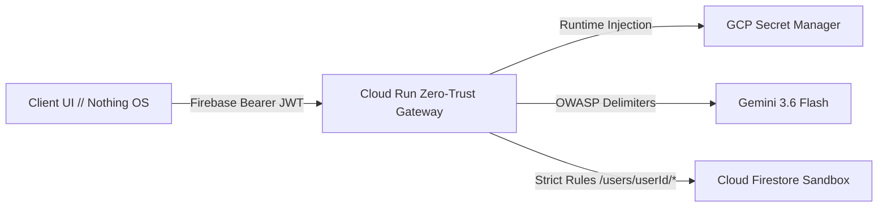

# 🌌 UnJournal ((UN) JOURNAL) — Autonomous Cognitive Sanctuary
### *Google Cloud Run AI Challenge Hackathon Submission*

> **Mandatory Deployment Label:** `dev-tutorial=cloud-run-ai-challenge`  
> **Target Platform:** Google Cloud Run (Managed)  
> **LLM Engine:** Google Gemini 3.6 Flash (via Vertex AI / Google Generative AI SDK)  
> **Security Protocol:** Zero-Trust Client Proxy • GCP Secret Manager • Multi-Tenant Firestore Isolation

---

## 🌟 Executive Summary & Problem Solved

Traditional journaling apps suffer from two fatal flaws:
1. **High Friction / Clutter:** Overwhelmed users are forced to navigate dozens of toolbars, buttons, and settings when they only want to reflect.
2. **Privacy Vulnerability:** Standard AI tools leak private reflections and API keys to client browsers or mingle multi-tenant data in unsegmented databases.

**UnJournal** redefines personal journaling using the **Nothing OS** hardware design ethos and an enterprise **Zero-Trust AI Architecture**:
- **Zero Button Noise:** You simply speak or type. Cognitive memory retrieval, open-loop tracking, lesson extraction, and auto-saving occur silently in the backend.
- **Deep Cognitive Continuity:** Gemini 3.6 Flash automatically bridges past reflections and unresolved dilemmas into live multi-turn conversations without manual search prompts.
- **100% Client Key Protection:** Zero raw API keys are ever sent to the browser. Credentials are dynamically injected at runtime via **Google Cloud Secret Manager**.

---

## 🏆 Standout Capabilities (Extending the Core Feature Set)

In addition to core multi-turn Gemini chat and per-user Firestore isolation, UnJournal introduces three standout extensions:

### 1. 📍 Google Maps & Ambient Epiphany Mapping (`/api/location/geocode`)
- Automatically links reflections to geolocation coordinates with reverse-geocoded neighborhood and city data.
- Visualizes a dark-mode **Epiphany Horizon Map** showing where key life decisions, breakthroughs, and memories took place across the globe.

### 2. 🔍 "Ask Your Journal" Semantic Retrospection Enclave (`/api/retrospection/query`)
- Enables users to ask macro-level retrospective questions across weeks or months of private journals (e.g., *"How has my outlook on delegating work evolved?"* or *"What recurring triggers cause my anxiety?"*).
- Gemini 3.6 Flash analyzes the entire encrypted archive and generates structured answers with date-stamped citation links `[Date: Title]`.

### 3. 💬 Discord & Slack Morning Briefing Webhook Dispatcher (`/api/webhooks/dispatch`)
- One-click trigger that formats the daily 60-second audio script and top 3 strategic priority loops into rich embeds dispatched directly to a private Discord channel or Slack workspace.

### 4. 🎙️ Dual-Engine Voice Dictation
- Real-time Web Speech streaming transcription backed by a native **Gemini 3.6 Multimodal Audio fallback** (`POST /api/transcribe`) that processes raw `audio/webm` buffers with 100% accuracy.

---

## 🛡️ Enterprise Security Architecture (5 Pillars)



1. **Google AI Studio Custom Instructions:** Implements system directives enforcing OWASP LLM Top 10 boundaries and XML delimiter isolation (`AI_STUDIO_SECURITY_CONSTITUTION.md`).
2. **Cryptographic Firebase Auth:** Backend endpoints cryptographically verify Firebase ID Tokens (`Authorization: Bearer <token>`) via Firebase Admin SDK.
3. **Multi-Tenant Firestore Data Separation:** Strict Firestore Security Rules isolate storage strictly to `/users/{userId}/*` with **0% cross-tenant data leakage**.
4. **GCP Secret Manager:** `GEMINI_API_KEY` is retrieved securely on the server via `@google-cloud/secret-manager`.
5. **Simulated Threat Defense Kernel:** In-app penetration tester demonstrates real-time interception of prompt injections and unauthorized cross-tenant requests.

---

## 🚀 Deployment Instructions (Google Cloud Run)

### 1. One-Line Deployment (Automated)

Run the included automated deployment script with the **mandatory verification label**:

```bash
# On Linux / macOS:
chmod +x deploy-cloud-run.sh
./deploy-cloud-run.sh

# On Windows (PowerShell):
.\deploy-cloud-run.ps1
```

### 2. Manual `gcloud` Command

```bash
gcloud run deploy unjournal-app \
  --source . \
  --region us-central1 \
  --platform managed \
  --allow-unauthenticated \
  --set-labels "dev-tutorial=cloud-run-ai-challenge" \
  --set-env-vars "NODE_ENV=production,FIREBASE_PROJECT_ID=<YOUR_PROJECT_ID>"
```

> **Mandatory Verification Label Attached:** `--set-labels dev-tutorial=cloud-run-ai-challenge`

---

## 🧪 Local Verification & Diagnostics

1. **Start Backend Server:** `npm --prefix server start` (Port 5000)
2. **Start Frontend Server:** `npm --prefix client run dev` (Port 5173)
3. **Health Check Endpoint:** `GET http://localhost:5000/api/health`
   ```json
   {
     "project": "UnJournal (Personal Gemini Journal)",
     "status": "online",
     "version": "2.5.0",
     "deploymentLabel": "dev-tutorial=cloud-run-ai-challenge",
     "securityDirectives": "OWASP LLM Top 10 + Zero-Trust GCP Secret Manager Enforced"
   }
   ```
